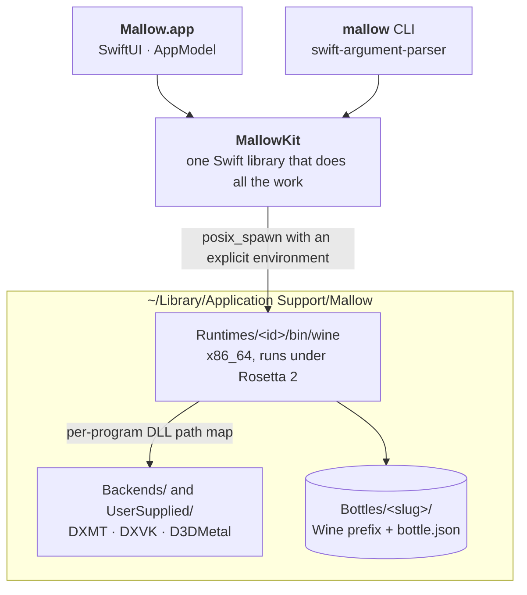
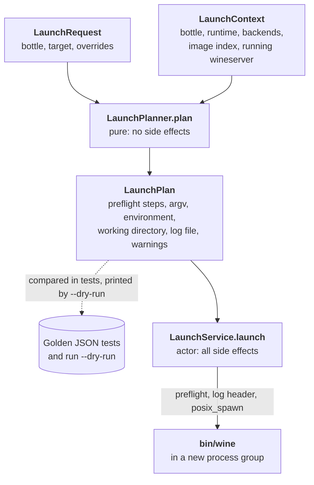

# Architecture tour

[DESIGN.md](../DESIGN.md) is over 4,000 lines long. You don't need to read it front to back before you can help. This tour takes about ten minutes. It gives you the shape of the system and links to the exact sections you need.

!!! info "Everything here is planned"

    No application code exists yet. The design is at "Draft 2", and the first code lands in v0.1. When this tour and DESIGN.md disagree, DESIGN.md is right.

**Before you start**, two conventions from [How to read this document](../DESIGN.md#how-to-read-this-document):

- **Confidence tags.** Facts are tagged **[H]** (verified against a primary source or tested), **[M]** (credible, but a test must confirm it) or **[L]** (unverified). No code may depend on an [L] item until it is verified.
- **Normative sections.** The Swift API in [§3.4](../DESIGN.md#34-mallowkit-public-api) and the file formats in [§3.7](../DESIGN.md#37-file-formats) must be followed exactly, so that people can build modules in parallel.

## Minute 1: the big picture

Read the [Summary](../DESIGN.md#0-summary) and the eight [Key decisions](../DESIGN.md#key-decisions). Mallow has three layers of our own, plus the separately downloaded Wine runtime:

- **MallowKit** holds all the logic. The app and the CLI are thin frontends over it.
- **CLI first.** Every feature lands in MallowKit and the CLI before it gets UI ([§1.3](../DESIGN.md#13-design-principles)).
- **The runtime is a separate program.** MallowKit only *starts* Wine and never links it, which keeps the LGPL runtime and the 0BSD frontend apart ([§2.1](../DESIGN.md#21-licences-decided)).

The [overview diagram in §3.1](../DESIGN.md#31-overview) has more detail.

## Minute 2: MallowKit's folders

MallowKit is **one SwiftPM target**, split into folders that form layers. Each folder may use only the folders to its left, and `scripts/lint.sh` enforces this ([§3.2](../DESIGN.md#32-repository-layout)):

`Support → Bottles → Runtime → Wine → Programs → Graphics → Launch → Operations → Recipes → Diagnostics → Composition`

| Folder | What it owns | Types to know | API |
|---|---|---|---|
| **Support** | Product identity, paths, file locks, file watching, JSON wire coding, hashing, signatures, HTTP, process spawning, provenance checks | `ProductIdentity`, `MallowPaths`, `FileLock`, `EventBus`, `ProcessSpawner`, `ProvenanceGuard` | [§3.4.1](../DESIGN.md#341-support) |
| **Bottles** | The `bottle.json` model and its settings, templates, DLL overrides, and what has been applied to the prefix | `BottleConfig`, `BottleSettings`, `BottleStore`, `AppliedState` | [§3.4.2](../DESIGN.md#342-bottles) |
| **Runtime** | The catalog, installing and verifying runtimes, the runtime manifest, probing what a runtime can do, importing Standard Wine | `RuntimeManager`, `ComponentInstaller`, `RuntimeFeatures`, `RuntimeCapabilityProbe` | [§3.4.3](../DESIGN.md#343-runtime) |
| **Wine** | Building Wine's environment, Wine commands, Windows↔Unix paths, `.reg` files, settings planning, `wineserver` control | `WineEnvironment`, `WineCommand`, `RegistryFile`, `SettingsPlan`, `WineserverController` | [§3.4.4](../DESIGN.md#344-wine) |
| **Programs** | `.lnk` and PE parsing, icons, program discovery, Steam libraries, the image index, prefix audits, Mac shortcuts | `PEFile`, `ShellLink`, `ProgramDiscovery`, `SteamLibrary`, `ImageIndex` | [§3.4.5](../DESIGN.md#345-programs) |
| **Graphics** | Backend manifests and storage, choosing a backend, configuring it, the per-program DLL path map, the GPTK import | `BackendResolver`, `BackendConfigurator`, `GraphicsPlanner`, `ImageBackendMap`, `GPTKImporter` | [§3.4.6](../DESIGN.md#346-graphics) |
| **Launch** | The pure launch planner, and the one service that starts every Wine process | `LaunchPlanner`, `LaunchPlan`, `LaunchService`, `LogSession` | [§3.4.7](../DESIGN.md#347-launch) |
| **Operations** | Creating bottles, applying settings, prefix templates, importing bottles | `BottleCreator`, `BottleSettingsApplier`, `PrefixTemplateCache`, `BottleImporter` | [§3.4.8](../DESIGN.md#348-operations) |
| **Recipes** | The recipe format, runner and validator, licence terms, winetricks | `Recipe`, `RecipeRunner`, `TermsCatalog`, `WinetricksRunner` | [§3.4.9](../DESIGN.md#349-recipes-diagnostics-composition) |
| **Diagnostics** | `mallow doctor` and the diagnostics bundle | `Doctor`, `DiagnosticsBundle` | [§3.4.9](../DESIGN.md#349-recipes-diagnostics-composition) |
| **Composition** | Wiring everything together into one object graph | `MallowServices` | [§3.4.9](../DESIGN.md#349-recipes-diagnostics-composition) |

Two rules keep parallel work from colliding:

- **One type, one file.** [§3.4.10](../DESIGN.md#3410-type-to-file-ownership-normative) says which file defines each public type.
- **A file that isn't in the [repository layout](../DESIGN.md#32-repository-layout) needs a design change first.**

## Minute 3: the `mallow` CLI

The CLI ([§3.8](../DESIGN.md#38-the-mallow-cli)) exposes all of MallowKit. It lives in `Sources/MallowCLI/`, one file per command group, built on swift-argument-parser.

- The [command tree](../DESIGN.md#381-command-tree) covers runtimes, backends, bottles, programs, `run`, recipes, logs, diagnostics and licences.
- Global options come before the command: `mallow [--home <dir>] [--json] [--quiet] [--verbose] <command>`. Every test uses `--home`, so tests never touch real data.
- [Exit codes](../DESIGN.md#383-exit-codes) are stable and map one-to-one from `MallowError` cases, so scripts can rely on them.
- [`run --dry-run`](../DESIGN.md#382-run-semantics) prints the complete launch plan as JSON and runs nothing. The same code path produces the golden test files.

## Minute 4: the app

The app ([§3.9](../DESIGN.md#39-the-swiftui-app)) is a SwiftUI `NavigationSplitView`: bottles in the sidebar, a program grid in the detail view, and sheets for settings, runtimes, licence terms and onboarding.

- `AppModel` is an `@Observable @MainActor` class that listens to MallowKit's `EventBus`.
- Every settings edit goes through `BottleSettingsApplier.edit`, the same path the CLI uses.
- It builds with the **Command Line Tools only**. That means no `#Preview`, no `@Entry` and no asset catalogs.
- `scripts/build-app.sh` assembles and signs the `.app` bundle without Xcode ([§3.10](../DESIGN.md#310-building-the-app-without-xcode)). The CLI product is `mallow` and the app product is `MallowApp`, because macOS file systems are usually case-insensitive and `mallow` and `Mallow` would collide.

## Minutes 5–6: the launch planner { #the-launch-planner }

This is the heart of the design, and the part most worth understanding.

**`LaunchPlanner` is a pure planner** ([Key decision 5](../DESIGN.md#key-decisions), [§3.4.7](../DESIGN.md#347-launch)). It takes a `LaunchRequest` (what to run, in which bottle, with which overrides) and a `LaunchContext` (the bottle, the runtime, the installed backends, the image index, any running `wineserver`). It returns a `LaunchPlan` value holding everything the launch needs: any prefix work to do first, the executable, argv, the **complete** environment, the working directory and the log file.

Planning has no side effects. The clock, the UUID generator and PE-header reading are injected, so the planner can be tested without Wine against golden JSON files (`Tests/MallowKitTests/Golden/launch-*.json`).

**`LaunchService` carries out plans.** It is an actor, and the **only** code that starts Wine processes for a bottle, whether a game, `regedit`, `wineboot` or winetricks. That makes it the only writer of the bottle's `AppliedState`, the record of what has actually been applied to the prefix.

The eight planning stages, and what `LaunchService` does with the plan, are in [§5.1 Stages](../DESIGN.md#51-stages). [§5.2](../DESIGN.md#52-environment-construction) explains how the environment is built in layers. Graphics decisions feed in through `GraphicsPlanner` and the [per-image backend map](../DESIGN.md#45-applying-backends-image-map-mode-and-environment-mode).

## Minute 7: concurrency, state and errors

[§3.5](../DESIGN.md#35-concurrency-state-ownership-and-error-model) is short and worth reading in full. The main points:

- **Swift 6 language mode** everywhere. Stateful services (`BottleStore`, `RuntimeManager`, `LaunchService` and others) are actors, and model types are `Sendable` values.
- **Heavy work never runs on the main thread.** Anything that hashes, extracts, scans or parses large files is `@concurrent` or an actor method. The upcoming feature `NonisolatedNonsendingByDefault` stays **off**, because it would move that work onto the caller's actor.
- **One writer per piece of state.** The state-ownership table says who may write each file. `bottle.json` edits happen under an advisory `flock`, because the app, the CLI and a recipe may all edit the same bottle at once.
- **One error type.** `MallowError` is the only error that crosses the public API, and each case maps to a CLI exit code.

## Minute 8: where things live on disk

[§3.6 On-disk layout](../DESIGN.md#36-on-disk-layout) shows everything Mallow writes:

- `~/Library/Application Support/Mallow/` (or `$MALLOW_HOME`) holds `settings.json`, `Bottles/`, `Runtimes/`, `Backends/`, `UserSupplied/D3DMetal/`, `Templates/`, `Tools/` and `Recipes/`.
- Each bottle is a plain Wine prefix plus `bottle.json` and a `.mallow/` folder, which holds the lock file, the DLL path map and the image index.
- A `.mallow-root.json` marker stops Mallow from adopting another app's folder that happens to share the name.
- Caches and logs go in `~/Library/Caches/Mallow/` and `~/Library/Logs/Mallow/`. Every launch gets its own log file with a reproducible header.

The formats of those files are in [§3.7](../DESIGN.md#37-file-formats). Start with the [wire-format rules](../DESIGN.md#370-wire-format-rules-normative). Missing keys decode to defaults, `nil` is never written, and enums with payloads are single-key tagged unions.

The product identifiers (bundle ID, URL scheme, folder names) are listed once, in [§2.6.1](../DESIGN.md#261-product-identifiers-authoritative-list). The GitHub organisation and the bundle ID there are still proposals (open question Q4). The repository currently lives at [mixutin/Mallow](https://github.com/mixutin/Mallow).

## Minute 9: the runtime and graphics pipeline

The Wine runtime is built outside the app, in public GitHub Actions:

- **[§3.11](../DESIGN.md#311-runtime-build-pipeline-runtime-depsyml-runtimeyml)**: `deps.yml` builds the bundled libraries from pinned source. `runtime.yml` builds Wine 11.0 from CodeWeavers' published LGPL sources, then verifies, smoke-tests, signs and releases it, with the LGPL source archives beside every binary.
- **[§3.11.4](../DESIGN.md#3114-our-wine-patches-lgpl-21-or-later-written-by-us)**: our three small Wine patches. 0001 adds a private DLL search path, 0002 adds the per-image DLL path map, and 0003 points the crash dialog at our tracker.
- **[§3.12](../DESIGN.md#312-backend-component-packaging-runtimebackends-backendsyml) and [§3.13](../DESIGN.md#313-catalog-and-update-security)**: graphics backends are packaged as separate signed components, and the catalog is signed with protection against rollback.
- **[§3.11.6](../DESIGN.md#3116-standard-wine-interim-and-dev-fallback)**: a pinned "Standard Wine" build is the interim runtime until ours exists.
- **[§4](../DESIGN.md#4-graphics-backend-mechanics)**: how backends are chosen and applied. The key idea is "image-map mode": each Windows process looks up its own backend inside Wine, so games that Steam starts still get the right one.

Security sits across all of this. The [security model](../SECURITY_MODEL.md) sets the defaults (a Seatbelt sandbox around every Wine process, no `Z:` drive, no links into `$HOME`), and [§3.14](../DESIGN.md#314-relationship-to-docssecurity_modelmd) records how the two documents fit together.

## Minute 10: where to start { #where-to-start }

**Right now (Gate G0, before any code):**

- Read a section that matches what you know, and challenge it. Open questions are in [§10](../DESIGN.md#10-open-questions-decisions-needed), and the security model's are in its [§7](../SECURITY_MODEL.md#7-open-questions).
- Pick an item from the [verification backlog (§11)](../DESIGN.md#11-verification-backlog-assumptions-register) that your Mac can check, and report what you found.

**When code starts (v0.1):**

1. **WF0 comes first.** In week 1, `Support/WireCoding.swift`, every model type from §3.4 and `WireFormatTests` with their fixtures land together ([§3.7.0, rule 7](../DESIGN.md#370-wire-format-rules-normative)). Only then is the work split between people.
2. **Good first modules** are small, well specified and easy to test with synthetic fixtures: the `PEFile` and `ShellLink` parsers, `RegistryFile`, `DLLOverrideSet` and the pure `BackendResolver`. The [test inventory (§7.3)](../DESIGN.md#73-test-inventory-testsmallowkittests) lists the tests each module needs.
3. **Watch for issues** labelled `area:mallowkit` and `help wanted`.

**Whatever you work on:**

- Match the public signatures in §3.4 exactly, or change the design first.
- Cite an open source for every environment variable, registry key or DLL rule (the [provenance rule](../DESIGN.md#27-clean-room-and-contribution-rules-to-be-copied-into-contributingmd)).
- Start every file with its SPDX header, and sign off every commit (`git commit -s`).
- Read [§7 Testing strategy](../DESIGN.md#7-testing-strategy-and-ci) before you write tests. Tests use swift-testing and `fake-wine`, never real Wine.

Then set up your machine with the [development setup](dev-setup.md) guide.

## Glossary

Bottle
:   A Wine prefix plus Mallow's settings for it (`bottle.json`). One isolated Windows environment.

Prefix
:   Wine's name for a folder that holds a fake `C:` drive and a registry.

Runtime
:   A versioned, signed Wine build that Mallow downloads, such as `mallow-runtime-11.0-r1`.

Backend
:   A Direct3D translation layer: D3DMetal, DXMT, DXVK (with MoltenVK) or wined3d.

Image
:   A Windows executable file (`.exe`). Backend rules are matched per image.

DLL path map
:   A per-bottle file (`.mallow/dllpath-map`) that patch 0002 reads, so each process gets its own backend.

`wineserver`
:   The background process that coordinates all Wine processes in one prefix.

New WoW64
:   Wine's mode for running 32-bit Windows code inside a 64-bit Wine process. It is the only mode Mallow's bottles use.

CX source
:   The LGPL source tarball that CodeWeavers publishes. Mallow's runtime is built from it, under the LGPL.

CLT
:   Apple's Command Line Tools: Swift and the build tools without Xcode.
