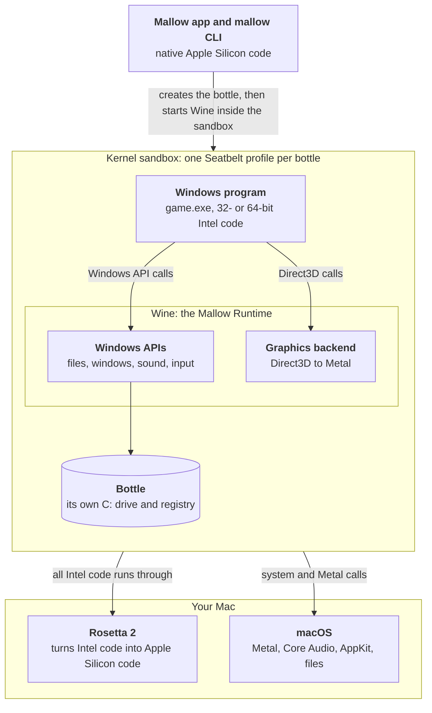

# How it works

!!! info "This describes the planned design"

    Mallow is pre-alpha and nothing here is built yet. This page explains the design in plain English. The full technical detail is in the [design document](DESIGN.md) and the [security model](SECURITY_MODEL.md).

## The short version

A Windows game is a program written for a different operating system (Windows) and a different kind of processor (Intel or AMD, "x86"). To run it on an Apple Silicon Mac, Mallow plans to stack four pieces of software, each solving one part of the problem:

1. **Wine** gives the program the Windows it expects, by reimplementing Windows' programming interfaces on top of macOS.
2. **Rosetta 2** translates the Intel processor instructions into Apple Silicon ones.
3. **A graphics backend** turns the game's DirectX drawing commands into Metal, the Mac's graphics interface.
4. **Mallow** ties it together. It keeps each program in its own **bottle**, picks the right settings and graphics backend, and runs everything inside a **kernel sandbox** so that a Windows program cannot reach the rest of your Mac.

The rest of this page takes the layers one at a time.

## Wine: a translator, not an emulator

Windows programs don't talk to the hardware directly. They ask Windows to do things for them: open a file, create a window, play a sound, draw a triangle. They do this by calling functions in Windows' system libraries, such as `kernel32.dll`, `user32.dll` or `d3d11.dll`. Together, these functions are the Windows **API**.

[Wine](https://www.winehq.org/) is an open-source reimplementation of those libraries. When a game calls "create a window", Wine's version of that function creates a real macOS window instead. The game's own code runs as it is. Nothing pretends to be a whole PC.

That is why Wine is **not an emulator** (the name even stands for "Wine Is Not an Emulator"):

| | An emulator or virtual machine | Wine |
|---|---|---|
| What it imitates | A whole computer, with its own copy of Windows | Only the Windows API |
| Needs a Windows licence | Yes | No |
| Overhead | Runs a second operating system | Runs the program as a normal Mac process |
| How it fits in | A separate desktop in a window | Windows programs get ordinary Mac windows, in the Dock and next to your other apps |

Wine is a huge, decades-long community effort, and it can't run every program perfectly. Some programs need extra components (Microsoft's Visual C++ runtime, fonts and so on), and some don't work at all. Mallow plans to handle the common extras with **recipes**. A recipe always tells you where each download comes from and shows its licence terms first.

## Rosetta 2: Intel code on Apple Silicon

Almost all Windows games are compiled for Intel and AMD processors (**x86** and **x86_64**). Apple Silicon Macs use a different instruction set (**arm64**). So even with Wine, the game's machine code can't run on the chip directly.

**Rosetta 2** is Apple's translator for exactly this. It converts x86_64 instructions into arm64 instructions, mostly ahead of time, and just in time where it has to. Mallow plans to run an **x86_64 build of Wine** under Rosetta 2. The Windows program's code and Wine's code are then translated together.

- **64-bit Windows programs** run directly in that x86_64 Wine.
- **32-bit Windows programs** run through Wine's "new WoW64" mode, which runs them inside the same 64-bit Wine process. Mallow's bottles use this mode only.
- **Installing Rosetta** means accepting Apple's software licence. Mallow will ask you first, and it never accepts on your behalf.

!!! note "Rosetta's future"

    Apple has said that macOS 27 is the last release with full Rosetta support, and that macOS 28 keeps a subset for games. How big that subset is isn't clear yet. Mallow follows Apple's announcements. A native Apple Silicon Wine is a research topic for after version 1.0 (see the [roadmap](roadmap.md)).

## Graphics: from DirectX to Metal

Windows games draw with **Direct3D**, part of Microsoft's DirectX. Macs draw with **Metal**. Something has to translate between the two, and there is more than one way to do it. Mallow plans to support four **graphics backends**:

| Backend | Used for | How it works | Where it comes from | Notes |
|---|---|---|---|---|
| **D3DMetal** | Direct3D 12, and Direct3D 11 if you prefer it | Apple's own Direct3D-to-Metal translator, part of the Game Porting Toolkit (GPTK) | **You import it** from your own copy of Apple's GPTK. Mallow never ships it | Proprietary Apple software under Apple's licence. 64-bit games only. Offers DLSS-to-MetalFX upscaling on macOS 26 and later |
| **DXMT** | Direct3D 10 and 11 | Open-source translator that goes straight to Metal | A signed Mallow download, repackaged from the upstream release | Needs the Mallow Runtime. Offers MetalFX spatial upscaling |
| **DXVK + MoltenVK** | Direct3D 10 and 11 | DXVK turns Direct3D into Vulkan, then MoltenVK turns Vulkan into Metal | A signed Mallow download (the DXVK-macOS branch). MoltenVK is part of the runtime | Two translation steps. Can also work on Standard Wine builds |
| **wined3d** | Direct3D 9 and older, DirectDraw, and a fallback for everything else | Wine's own built-in implementation | Part of Wine | Always available. The usual choice for Direct3D 9 and older games |

You can choose a backend for a whole bottle or for a single program. The default, **auto**, looks at which Direct3D libraries each program uses and picks for you:

- a **Direct3D 12** game uses **D3DMetal**, if you have imported it;
- a 64-bit **Direct3D 11** game uses **DXMT** (or D3DMetal, if you prefer it);
- games that use only **Direct3D 9** or older use **wined3d**;
- if the preferred backend isn't installed, Mallow falls back from DXMT to DXVK to wined3d, and tells you why.

The choice is shown in the launch log, in `mallow run --dry-run`, and in the app. If you choose a backend yourself, Mallow never swaps it silently. If it can't be used, you get an error that says why.

**Per game, even inside Steam.** Steam starts games itself, with its own settings. Normally that would give every Steam game the same backend. The Mallow Runtime includes a small Wine patch that is planned to let each Windows program look up its own backend, inside Wine, whoever starts it. So Steam can use Wine's built-in graphics while each of your games uses the backend that suits it.

!!! warning "D3DMetal is never included"

    D3DMetal is Apple's proprietary software, and its licence does not let us redistribute it. Mallow will import it from Apple's Game Porting Toolkit disk image that **you** download with your own Apple ID. Mallow shows you Apple's licence and needs your explicit "I accept" before it copies anything. The files are copied unchanged, stay on your Mac, and are never uploaded or put in a diagnostics bundle. See [Legal & licensing](legal.md#d3dmetal-apple-game-porting-toolkit).

## Bottles

A **bottle** is a self-contained Windows environment for your programs. Wine calls it a "prefix". Each bottle has:

- its own **`C:` drive**, where programs are installed;
- its own **registry**, where Windows programs keep their settings;
- its own **settings** in Mallow: Windows version, graphics backend, Retina mode, key mapping, environment variables, and more.

Bottles are planned to live in `~/Library/Application Support/Mallow/Bottles/`. Keeping programs in separate bottles means a problem in one can't affect the others. You might keep Steam in one bottle, an old game in another, and a tool you don't trust yet in a third. Deleting a bottle moves it to the Trash.

Mallow plans to offer bottle **templates** for common cases (`standard`, `gaming` and `steam`). Each bottle has its own `wineserver`, the background process Wine uses to coordinate a bottle's programs, so stopping one bottle doesn't touch the others.

## The Mallow Runtime

The Wine that Mallow uses is called the **Mallow Runtime**. It is a separate, versioned download, not part of the app. It is planned to be:

- **Based on Wine 11.0 from CodeWeavers' published LGPL source release.** Only that Wine includes the pieces DXMT and D3DMetal need, and a faster way for Windows programs to synchronise (MSync). We use those sources under the LGPL, and never use anything from inside CodeWeavers' commercial app.
- **Patched lightly.** Three small patches we write ourselves: two make per-program graphics backends work, and one points Wine's crash dialog at Mallow's issue tracker.
- **Built in public.** Built in GitHub Actions from pinned sources, including every library it bundles, so anyone can check how a release was made.
- **Signed and verified.** Each runtime comes with a signed manifest that lists a SHA-256 hash for every file. Mallow checks both, and refuses to install anything that doesn't match.
- **Published with its source.** Every runtime release carries its complete corresponding source beside it, as the LGPL requires.

Until the Mallow Runtime is ready, Mallow plans to support a pinned "Standard Wine" build (Gcenx's macOS builds of WineHQ Wine) as a stopgap. It has fewer features: no MSync, no DXMT and no D3DMetal. Bottles on it can use wined3d and DXVK.

## Security: a sandbox around every Windows program

Wine is a compatibility layer, **not a sandbox**. Out of the box, a Windows program running under Wine can read and write everything your Mac user account can, see your whole disk through drive `Z:`, and reach your real Documents and Desktop folders. A Windows info-stealer running under plain Wine can steal your files just as it would on a PC.

Mallow's goal is that **running a suspicious `.exe` in Mallow puts at risk only the bottle it runs in, never the rest of your Mac.** The plan has five layers:

1. **A kernel sandbox, the real boundary.** Every Wine process runs under a macOS Seatbelt sandbox profile that Mallow generates for each bottle. The kernel enforces it, so it still applies when a program skips Wine and talks to macOS directly. By default, a program can reach only its own bottle, the read-only runtime, the system files it needs, and folders you've chosen to share.
2. **Secure bottle defaults.** No `Z:` drive. Real Documents and Desktop folders inside the bottle instead of links to yours. Windows programs can't create Mac file associations, or quietly open Mac apps and web links. Programs that add themselves to startup are flagged.
3. **Trust modes for each launch.** **Standard** is for games and apps you know. **Offline** is the same with the network off. **Untrusted** is for things you don't trust: no network, no shared folders, and a disposable copy of a bottle. The copy is made instantly with APFS cloning and deleted when the program quits. Unsigned downloads are planned to default to Untrusted.
4. **Signed downloads.** Runtimes and graphics backends are verified against signatures before they are installed.
5. **Transparency.** Each bottle has a Security panel, and blocked actions are logged, so you can tell "the sandbox blocked this" apart from "this program is broken".

!!! danger "No sandbox is perfect"

    Mallow is **not an antivirus**. It limits what a program can reach, but it doesn't decide whether the program is malicious. Bugs in macOS, Rosetta or GPU drivers can in principle break any sandbox. Anything you share into a bottle, or keep in it (like a Steam login), is exposed to every program in that bottle. The first sandbox profile blocks known escape routes. It is planned to tighten into a strict allow-list later, and to get an external security review before version 1.0. Don't run known malware on a Mac that holds important data.

The [security model](SECURITY_MODEL.md) has the threat model, the sandbox profile sketch and the red-team test plan.

## Putting it together: launching a program

Here is what is planned to happen when you double-click a Windows program in Mallow:

1. Mallow checks that Rosetta and the bottle's runtime are installed.
2. It reads the program's `.exe` header to see which Direct3D version it uses, and resolves the graphics backend.
3. It works out everything the launch needs: registry changes, the backend map, environment variables, the working folder and the log file. This step, the **launch planner**, has no side effects, so it can be tested without Wine (see the [architecture tour](contributing/architecture-tour.md#the-launch-planner)).
4. It applies any pending bottle changes, then starts Wine inside the bottle's sandbox, with a log file for the launch.
5. It tracks the program until it quits, and cleans up anything that was only needed for that launch.

`mallow run --dry-run` is planned to print the whole plan without running anything, so you can always see exactly what Mallow would do.
