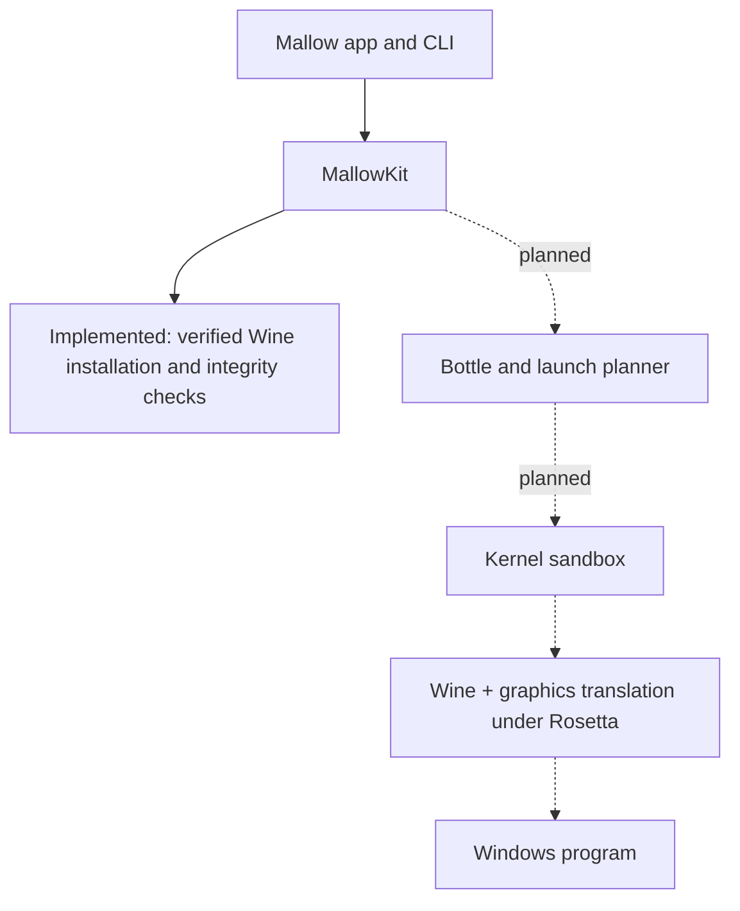

# How it works

!!! info "Current installation versus the planned launcher"

    The preview now installs the pinned Wine runtime and verifies its files. The Windows execution stack below remains planned: GStreamer/capability setup, bottles, graphics configuration and the kernel sandbox are not finished. A registered runtime is not a working Windows launcher. See [installation design](runtime-installation.md) and [current roadmap](roadmap.md).

[Toimintaperiaate suomeksi](https://mixutin.github.io/Mallow/fi/how-it-works/).

## The short version

The target product combines Wine's Windows APIs, Rosetta's instruction translation, a graphics backend and Mallow's bottle/launch management. A tested kernel boundary must keep Windows processes within their approved files and services.

Setup currently stops before the launch path. No Wine or Windows process is executed during installation or its CI check.

## Wine: a translator, not an emulator

[Wine](https://www.winehq.org/) implements Windows programming interfaces on another operating system rather than installing a complete Windows virtual machine. Program compatibility depends on the APIs, components and graphics used. Individual apps and dependency packages retain their own licence terms. Wine itself is not a sandbox.

The current installer keeps the upstream `Wine Stable.app` bundle intact. It does not yet create Wine prefixes, run `wineboot`, probe every runtime capability or claim game compatibility.

## Rosetta 2: Intel code on Apple Silicon

The design uses an x86-64 Wine build on Apple Silicon through Apple's instruction translation. Mallow detects the Rosetta marker and can request its installation through Apple's fixed system tool after explicit licence consent. Rosetta is unnecessary merely to open the native setup app.

Future macOS compatibility must follow Apple's actual support commitments. Native runtime research and broader architecture support remain later work; no current preview guarantees operation on a future macOS release.

## Graphics: from DirectX to Metal

The intended backends are D3DMetal from a user-supplied Apple toolkit, DXMT, DXVK with MoltenVK and Wine's built-in wined3d. Per-program selection and the Wine patch needed to preserve that selection through launchers are future work. None of those Mallow graphics controls is implemented merely by installing the standard runtime.

An explicit backend selection should never silently change. Future automatic choices must be constrained by measured runtime capabilities and explain fallback reasons. The current standard-runtime installer has no complete backend/capability probe.

D3DMetal is never downloaded or bundled by Mallow. User-supplied GPTK import remains planned and must preserve the applicable consent, licence and provenance requirements. See [Legal & licensing](legal.md#d3dmetal-apple-game-porting-toolkit).

## Bottles

A bottle is a separate Wine environment with its own C: drive, registry and settings. Mallow plans templates, per-bottle runtime choices, program lists, lifecycle controls and explicit sharing. The bottle store/creator is unfinished.

Separate directories alone are not a security boundary. Isolation between bottles and the host must come from the actual tested launch sandbox, not from naming a folder a bottle.

## The Mallow Runtime

The long-term runtime is a separately built/versioned open Wine package with reviewed patches, dependency/source inventories, public CI, signed manifests/catalogs and corresponding source publication. It is not yet built by this repository.

The interim installer accepts only the compiled-in Standard Wine 11.0_1 archive. It verifies source/size/hash, copies the archive into private staging, rechecks that snapshot, performs bounded extraction and registers the complete bundle. Its local receipt enables corruption detection; it is not the planned signed runtime manifest. Generic imports, multimedia dependencies, capability probes, repair and rollback remain open.

## Security: a sandbox around every Windows program

The target system requires kernel-enforced isolation, hardened prefixes, explicit sharing, trust modes and transparent denial reporting. The [security model](SECURITY_MODEL.md) describes the planned invariant and limitations. These features are not currently implemented.

The installer has a narrower boundary: consent, pinned inputs, constrained extraction, owned storage and verification. It never changes global Gatekeeper settings or executes downloaded Wine code. A checksum is not an antivirus verdict. Malware already running as the same user may alter local receipts and files; future authenticated catalog/launch protections are separate work.

## Putting it together: launching a program

The future pipeline checks host/runtime dependencies, selects a compatible backend, produces a pure deterministic launch plan, applies safe bottle changes and launches under the tested sandbox with bounded logging/process lifecycle management. `mallow run --dry-run` and the Notepad end-to-end milestone remain planned.

In this preview, use `mallow setup --install-runtime --accept-download`, `mallow runtime verify` and `mallow doctor`. Startup uses metadata rather than full runtime hashing; expensive file work and progress are designed not to block the UI. Actual-Mac performance and game compatibility require measurements, not inference from a passing build. See the [architecture tour](contributing/architecture-tour.md#the-launch-planner).
